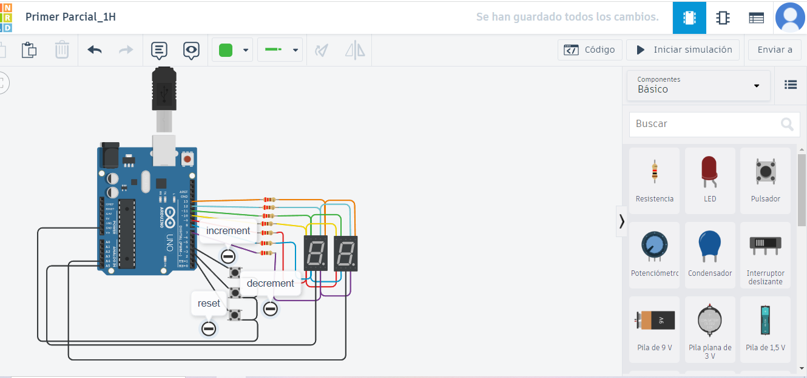

# Título del Proyecto

Contador de 0 a 99 con Display 7 Segmentos y Multiplexación

# Integrantes
-Fel Tajes Lucas Agustin
-Santiago Perez
-Valentin Casiriain

# Imagen 

## Descripcion:

Basicamente es un contador de dos diplay 7 segmentos con multiplexacion que van desde el 0 al 99

# Funcion Priuncipal:
las dos funciones principales son: keypressed y encenderSegmentos

int keypressed(void)
{
  sube = digitalRead(buttonIncrement);
  baja = digitalRead(buttonDecrement);
  reset	= digitalRead(buttonReset);
  if(sube == 1)
    subePrevia = 1;
  
  if(baja == 1)
    bajaPrevia = 1;
  
  if(reset ==1)
    resetPrevia = 1;
  
  	if(sube == 0 && sube != subePrevia)
  	{
    	subePrevia = sube;
    	return buttonIncrement;
  	}
  	if(baja == 0 && baja != bajaPrevia)
  	{
    	bajaPrevia = baja;
    	return buttonDecrement;
  	}
  	
  	if(reset == 0 && reset != resetPrevia)
  	{
    	resetPrevia = reset;
    	return buttonReset;
  	}
  	
  return 0;
}

La función keypressed monitorea el estado de tres botones: buttonIncrement, buttonDecrement y buttonReset. Esta función determina si alguno de estos botones ha sido soltado (cambiado de presionado a no presionado). Si detecta que un botón se ha soltado, devuelve el identificador del botón correspondiente (buttonIncrement, buttonDecrement o buttonReset). Si ningún botón se ha soltado, la función retorna 0 para indicar que no ha ocurrido ningún evento de soltar botón. En resumen, esta función ayuda a identificar qué botón se ha dejado de presionar en un sistema de detección de botones.

void encenderSegmentos(int digit) 
{ /*bueno esta funcion es la que prende los segmentos de dicho numero
  a formar*/
      digitalWrite(A, LOW);
      digitalWrite(B, LOW);
      digitalWrite(C, LOW);
      digitalWrite(D, LOW);
      digitalWrite(E, LOW);
      digitalWrite(F, LOW);
      digitalWrite(G, LOW);
  switch (digit){
    case 0:{
      digitalWrite(A, HIGH);
      digitalWrite(B, HIGH);
      digitalWrite(C, HIGH);
      digitalWrite(D, HIGH);
      digitalWrite(E, HIGH);
      digitalWrite(F, HIGH);
      digitalWrite(G, LOW);
      break;
    }
    case 1:{
      digitalWrite(A, LOW);
      digitalWrite(B, HIGH);
      digitalWrite(C, HIGH);
      digitalWrite(D, LOW);
      digitalWrite(E, LOW);
      digitalWrite(F, LOW);
      digitalWrite(G, LOW);
      break;
    }
      
    case 2:{
      digitalWrite(A, HIGH);
      digitalWrite(B, HIGH);
      digitalWrite(C, LOW);
      digitalWrite(D, HIGH);
      digitalWrite(E, HIGH);
      digitalWrite(F, LOW);
      digitalWrite(G, HIGH);
    
      break;
    }
    case 3:{
      digitalWrite(A, HIGH);
      digitalWrite(B, HIGH);
      digitalWrite(C, HIGH);
      digitalWrite(D, HIGH);
      digitalWrite(E, LOW);
      digitalWrite(F, LOW);
      digitalWrite(G, HIGH);
      break;
    }
     
    case 4:{
      digitalWrite(A, LOW);
      digitalWrite(B, HIGH);
      digitalWrite(C, HIGH);
      digitalWrite(D, LOW);
      digitalWrite(E, LOW);
      digitalWrite(F, HIGH);
      digitalWrite(G, HIGH);
      break;
    }
      
    case 5:{
      digitalWrite(A, HIGH);
      digitalWrite(B, LOW);
      digitalWrite(C, HIGH);
      digitalWrite(D, HIGH);
      digitalWrite(E, LOW);
      digitalWrite(F, HIGH);
      digitalWrite(G, HIGH);
  break;}
    case 6:{
      digitalWrite(A, HIGH);
      digitalWrite(B, LOW);
      digitalWrite(C, HIGH);
      digitalWrite(D, HIGH);
      digitalWrite(E, HIGH);
      digitalWrite(F, HIGH);
      digitalWrite(G, HIGH);
      break;}
    case 7:{
      digitalWrite(A, HIGH);
      digitalWrite(B, HIGH);
      digitalWrite(C, HIGH);
      digitalWrite(D, LOW);
      digitalWrite(E, LOW);
      digitalWrite(F, LOW);
      digitalWrite(G, LOW);
      break;}
    case 8:{
      digitalWrite(A, HIGH);
      digitalWrite(B, HIGH);
      digitalWrite(C, HIGH);
      digitalWrite(D, HIGH);
      digitalWrite(E, HIGH);
      digitalWrite(F, HIGH);
      digitalWrite(G, HIGH);
      break;}
    case 9:{
      digitalWrite(A, HIGH);
      digitalWrite(B, HIGH);
      digitalWrite(C, HIGH);
      digitalWrite(D, HIGH);
      digitalWrite(E, LOW);
      digitalWrite(F, HIGH);
      digitalWrite(G, HIGH);
      break;}
  }
}
 la funcion solamente prende y apaga los segmentos, para formar el numero en los displays
# link al proyecto:
- [proyecto](https://www.tinkercad.com/things/gjDgodxwmHg-recu-del-primer-parcial/editel)
